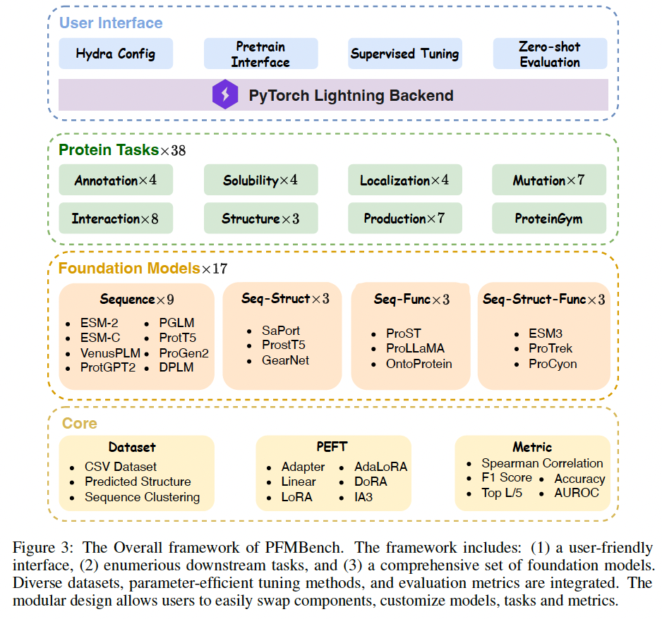

# PFMBench

[](LICENSE)

> **PFMBench**: A comprehensive Protein Foundation Model Benchmark suite.

---

## 🔍 Overview

PFMBench is a unified benchmark suite for evaluating Protein Foundation Models (PFMs) across dozens of downstream tasks. It supports both fine-tuning on labeled data and zero-shot evaluation, and is built on top of Hydra + PyTorch Lightning for maximum flexibility and reproducibility.

---

## 🌟 Features

* **38 downstream tasks** covering structure, function, localization, mutagenesis, interaction, solubility, production, and zero-shot settings.
* **17 pre-trained models** spanning sequence-only, structure-augmented, function-aware, and multimodal PFMs.
* **PEFT support**: Adapter, LoRA, AdaLoRA, DoRA, IA3, etc.
* **Zero-shot recipes**: MSA-based, protein language model, ProteinGym protocols.
* **Modular design**: Easily swap datasets, models, tuning methods, and evaluation metrics.
* **Logging & visualization** via Weights & Biases; built-in plotting in `output_model_plots/`.

---

## 📦 Installation

```bash
# Clone the repo
git clone https://github.com/biomap-research/PFMBench.git
cd PFMBench

# Install Python dependencies
conda env create -f environment.yml

# Or you can use our Docker image via: docker pull whwendell/pfmbench:latest
```

---

## 🗂️ Project Structure

```
PFMBench/
├── output_model_plots/      # Generated plots (scTM, diversity, etc.)
├── src/                     # Core library
│   ├── data/                # dataset loaders & preprocessors
│   ├── interface/           # generic task & model interface classes
│   ├── model/               # model wrappers & PEFT adapters
│   ├── utils/               # common utilities (metrics, logging, etc.)
│   └── __init__.py
├── tasks/                   # Fine-tuning experiments
│   ├── configs/             # Hydra config files
│   ├── results/             # Checkpoints & logs
│   ├── data_interface.py    # task-specific data loader
│   ├── model_interface.py   # task-specific model wrapper
│   ├── main.py              # entrypoint for training/eval
│   ├── tuner.py             # hyperparameter-search helper
│   └── __init__.py
├── wandb/                   # Weights & Biases scratch dir
├── zeroshot/                # Zero-shot pipelines
│   ├── msa/                 # MSA-based scoring
│   ├── pglm/                # protein-LM zero-shot
│   ├── saprot/              # ProteinGym protocol
│   ├── data_interface.py    # generic zero-shot data loader
│   ├── model_interface.py   # generic zero-shot model wrapper
│   ├── msa_kl_light.py      # light MSA KL-div zero-shot
│   ├── msa_kl_light copy.py # (backup—can remove)
│   └── proteingym_light.py  # light ProteinGym zero-shot
├── .gitignore
├── LICENSE
├── environment.yml
└── README.md
```

---

## 🚀 Quick Start

### Fine-tuning a single task

```bash
# Example: run fine-tuning with specific GPU and configs
env CUDA_VISIBLE_DEVICES=0 \
    python tasks/main.py \
    --config_name binding_db \
    --pretrain_model_name esm2_35m \
    --offline 0
```

### Zero-shot evaluation

```bash
# Example: run zero-shot MSA KL-div scoring
env CUDA_VISIBLE_DEVICES=0 \
    python zeroshot/msa_kl_light.py \
    --config_name zero_msa_kl \
    --pretrain_model_name esm2_35m \
    --offline 0
```

> Replace `--config_name`, `--pretrain_model_name`, and `--offline` flags as needed.

---

## 🖼️ Architecture Diagram


---

## 📖 Citation

If you use PFMBench in your work, please cite:

```bibtex
@article{gao2025pfmbench,
  title={PFMBench: Protein Foundation Model Benchmark},
  author={Gao, Zhangyang and Wang, Hao and Tan, Cheng and Xu, Chenrui and Liu, Mengdi and Hu, Bozhen and Chao, Linlin and Zhang, Xiaoming and Li, Stan Z},
  journal={arXiv preprint arXiv:2506.14796},
  year={2025}
}
```

---

## 📝 License

This project is licensed under the [Apache License 2.0](LICENSE).
